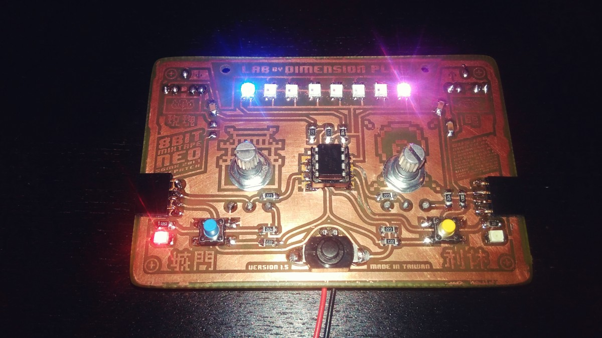
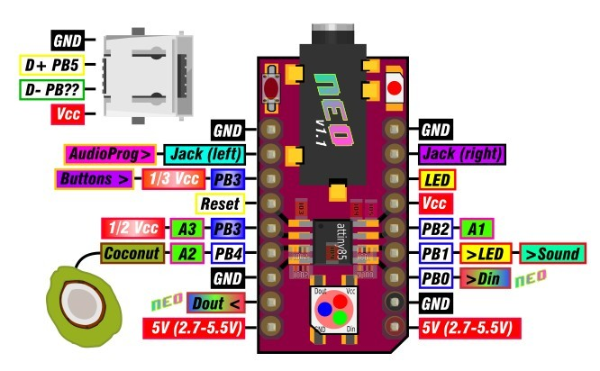
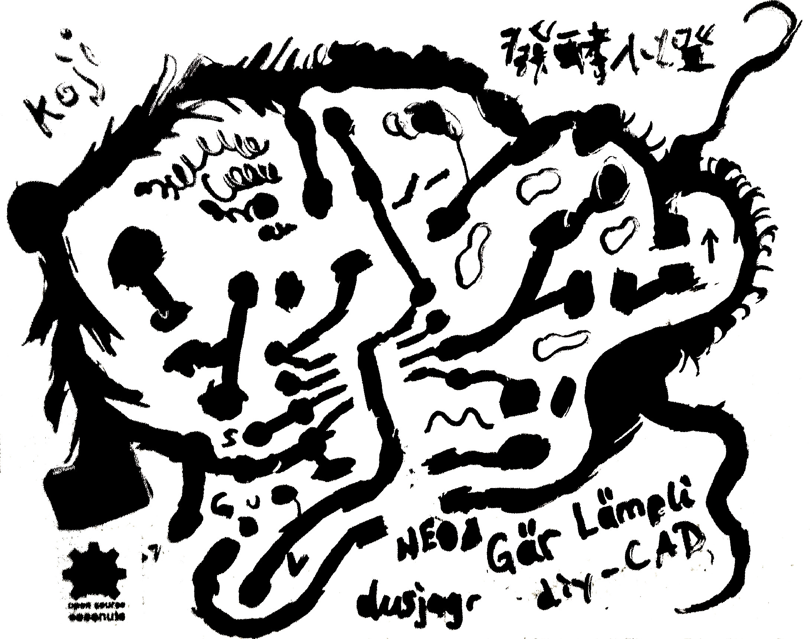

All the board designs can be found in the [github repo](https://github.com/8BitMixtape/8Bit-Mixtape-NEO/tree/master/boards). And check the different chapters to learn more about the specific boards.

## Hand-made

Many of the prototypes below are etched by hand during the PCB-residency by dusjagr at Dimension Plus LAB, TW.

## 8Bit Mixtape NEO

The [8Bit Mixtape NEO](https://github.com/8BitMixtape/8Bit-Mixtape-NEO/wiki/2_1-8Bit-Mixtape-NEO) is the newest edition of our series of mixtapes since 2013 and will rock "officially". 

This image is outdated but kept here for historic reasons and cos it looks nice! New board will be designed with similar looks, but based on the updated schematics.

## NEO Coconut

### The core of audio-prog attiny85 boards

Should add some description... Marc

### easy to DIY but we could aim to produce thousands!

OCPC: One Coconut per Child!

### Gär Lämpli

See the [Hackteria Wiki](http://wlu18www30.webland.ch/wiki/G%C3%A4r_L%C3%A4mpli) for more info. The output of our creative PCB design tool diy-CAD is on this git repo.

## DIMI-8

Honoring Erkki Kurenniemi

in progress...

## 8Bit NEO Euro-Rack

Anyone?

## Other Prototypes

### Chris' Cirkulouino-NEO-tape

Based and compatible to the [Schematics](https://github.com/8BitMixtape/8Bit-Mixtape-NEO/wiki/3_2-Schematics-Discussion) everybody can build their own application, extended, minimized, improved etc.

### dusjagr's 8Bit Mixtape Prototype

### More Prototypes

See more [Prototypes](https://github.com/8BitMixtape/8Bit-Mixtape-NEO/wiki/2_3-Protoypes) and [how to make them](https://github.com/8BitMixtape/8Bit-Mixtape-NEO/wiki/4_7-MYOB---Make-Your-Own-Board)