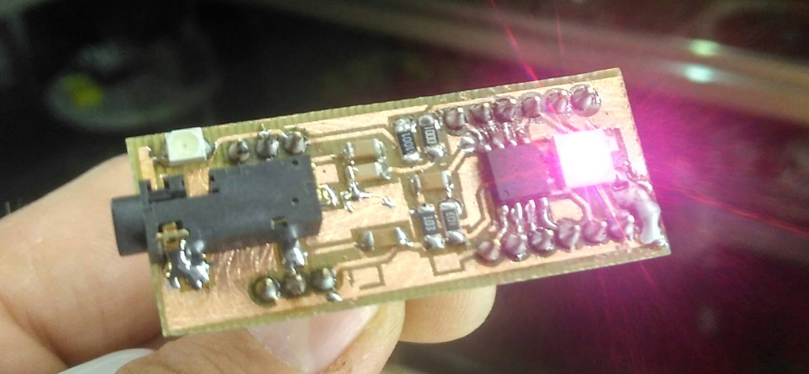
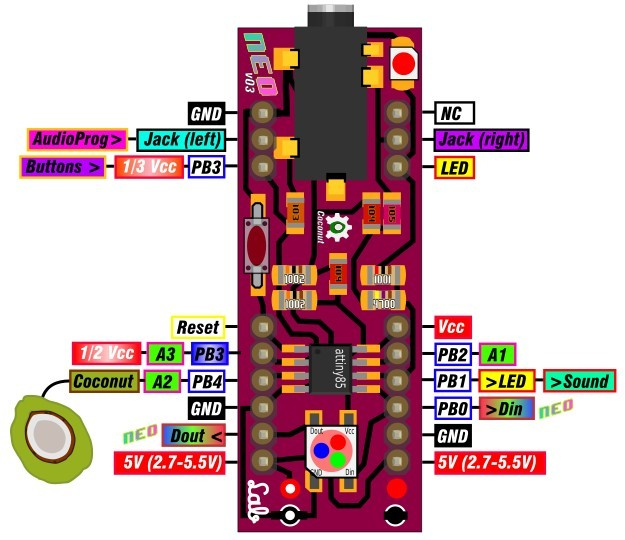
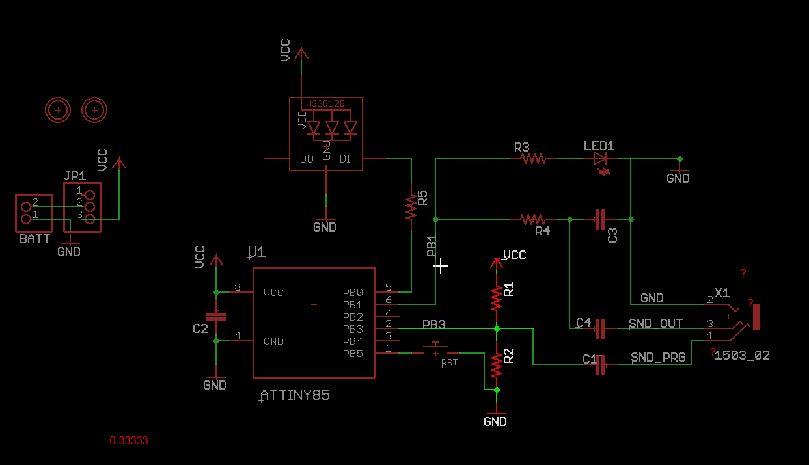
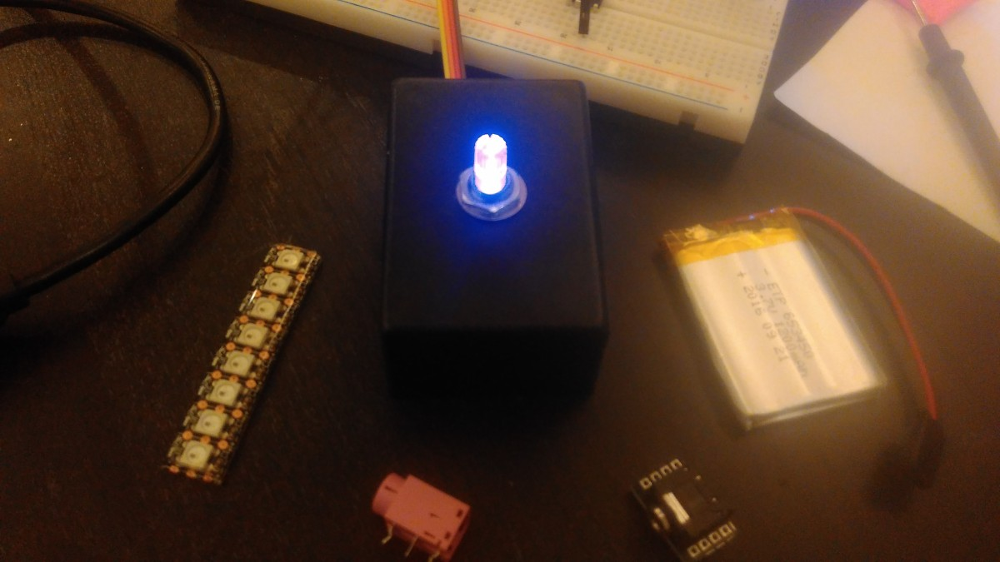
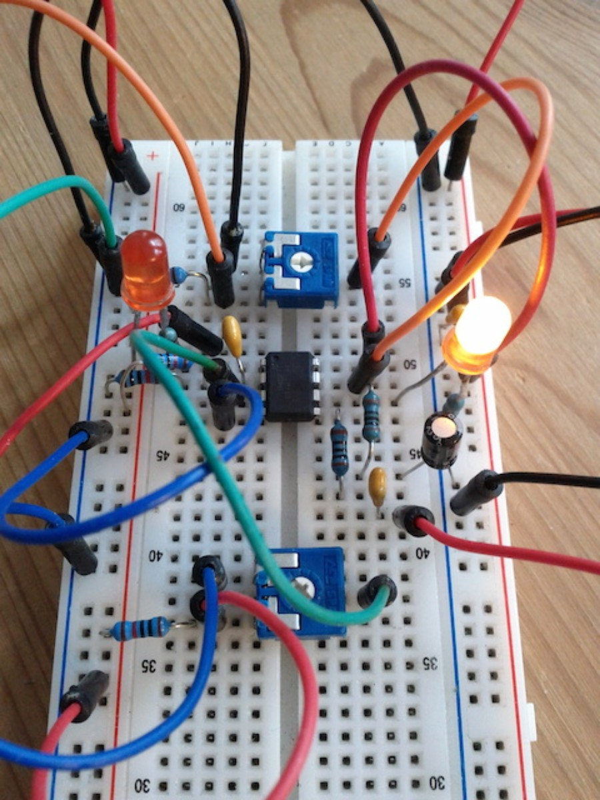

# Prototype boards

## Prototype for Breadboard Use

### Self-made on perfboard

see more on how to make it [here](https://github.com/8BitMixtape/8Bit-Mixtape-NEO/wiki/MYOB---Make-Your-Own-Board)

## Self-etched, 1-sided

## Chris geeking with circular 12 LED rings

## dusjagr's Proto-NEO 8Bit Mixtape

### let's get another prototype working made at proto-lab in Tokyo hotelroom

Making a protoype of the 8Bit Mixtape based on Schematics 0.9  

ugly backside... added big caps and that charging unit from china.  

## Eagle version by Yair

Hmmm eagle... why not KiCAD?

## 1Pixel Black-Box

## ...and a really ugly version

## Fredrik's test on Breadboard

