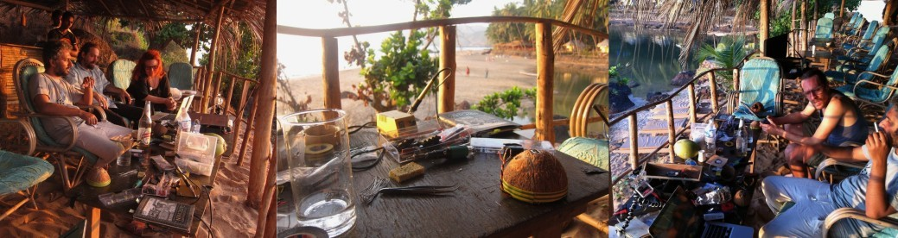
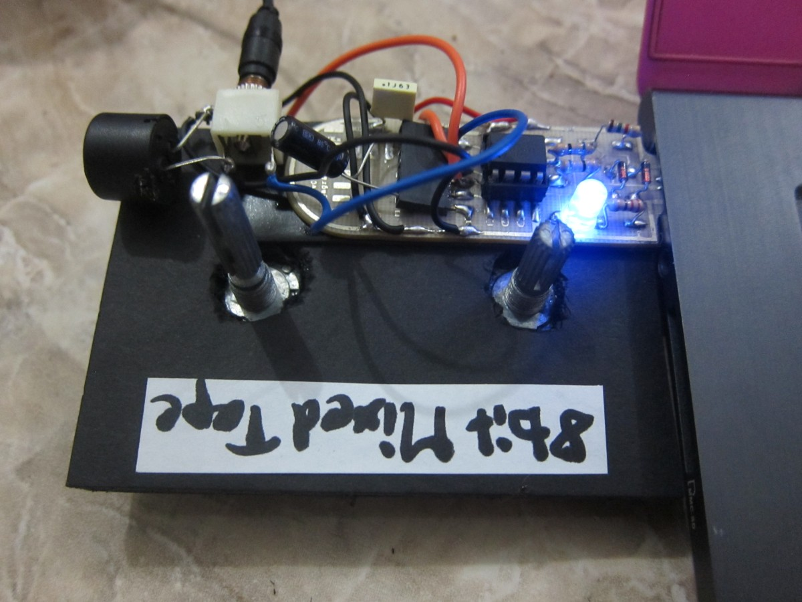
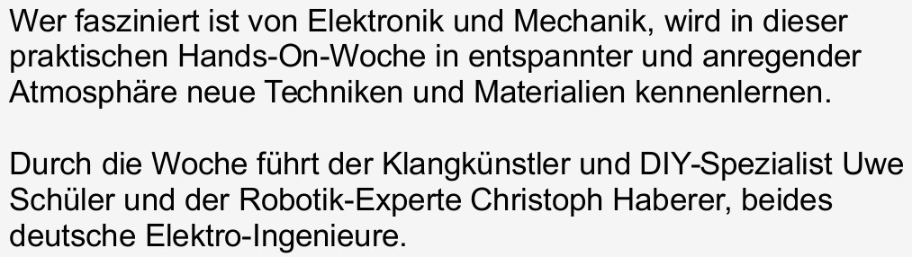
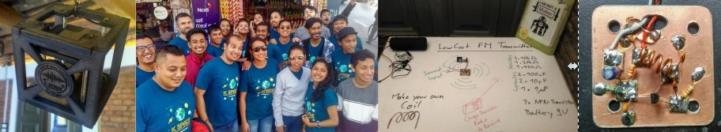
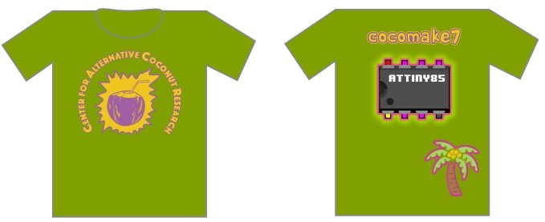
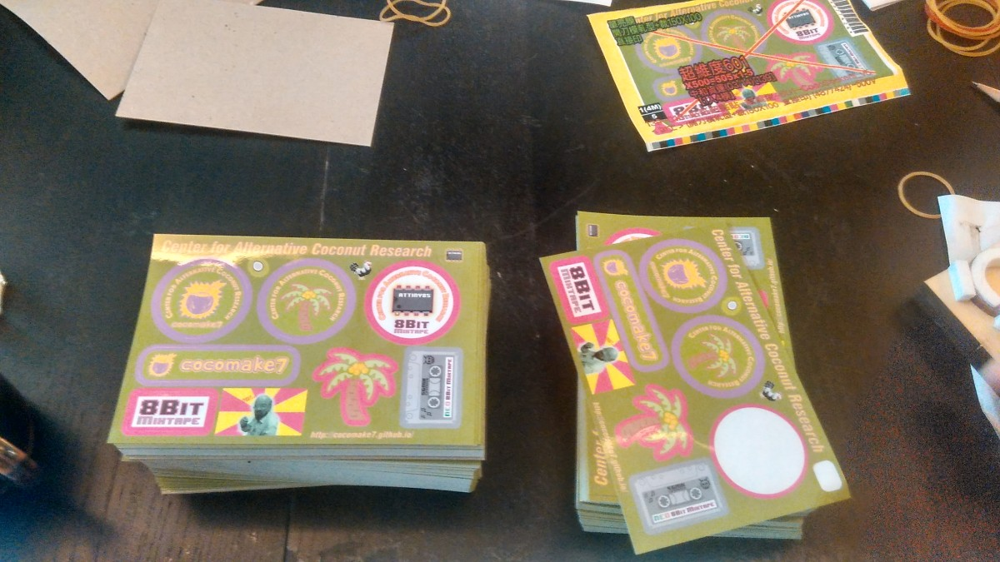

# Center for Alternative Coconut Research

Summarizing a bit the history of the developments and project that led to this!

See a [presentation by dusjagr](https://www.slideshare.net/dusjagr/cocomake7-and-smartcoconuts)

## It all started in Goa

After years of geeking in the SGMK community, HomeMade SummerCamps and a.n.y.m.a. Research weeks.

_Foundation of the Center for Alternative Coconut Research 2011_

  
We really needed to put a GNUSB into a Coconut for a "Wave-to-MIDI" converter.

_Michi presents the BabyGnusbuino at the SGMK DIY-Umtrunk, 2012_

[http://wiki.sgmk-ssam.ch/wiki/Babygnusbuino-v2](http://wiki.sgmk-ssam.ch/wiki/Babygnusbuino-v2)

_dusjagr thinks really hard about coconuts, Bangalore 2015_

[http://hackteria.org/wiki/CocoMake7](http://hackteria.org/wiki/CocoMake7)

[https://cocomake7.github.io/](https://cocomake7.github.io/)

## ... and Yogyakarta

[https://github.com/8BitMixtape](https://github.com/8BitMixtape)

_The "first" BabyGnusbuino Workshop in Yogya 2013_

## 8Bit Mixtapes

Geeking like crazy.... finding Viznut's OneLiner and implementing them on a BabyGnusbuino.

_First Mixtape Prototype 2013_

# Previous Memories

## SGMK Homemade 2007

Offene Do-It-Yourself-Arbeitswoche für **geniale Experimentierer. **The art of 8Bit sounds on microcontrollers...!

## K\_Space - Kathmandu Space Programme 2016

How to put a coconut satellie in low orbit?

# Links

## And various other previous work

other synth projects and audio programming by Christoph Haberer:

[http://roboterclub-freiburg.de/atmega\_sound/atmegaSID.html](http://roboterclub-freiburg.de/atmega_sound/atmegaSID.html)

[http://www.hobby-roboter.de/forum/viewtopic.php?f=5&t=3](http://www.hobby-roboter.de/forum/viewtopic.php?f=5&t=3)

# Merchandise

**Stickers are here!**

