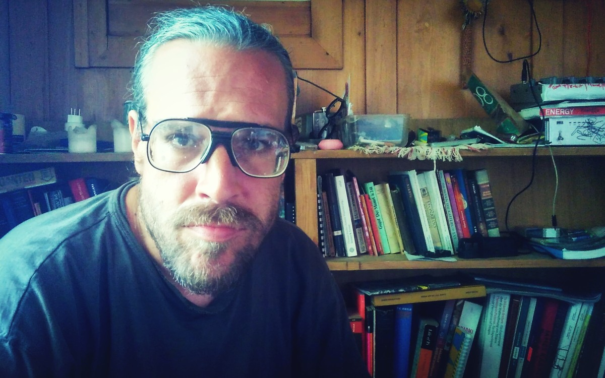

## Neo Coco Workshop
**Sat & Sunday, 10/11. June 2017, Tehnicki Muzej Nikola Tesla, Zagreb**

### Overview

During the NeoCoco Workshop the participants will learn how to solder SMD (surface mount devices) and build the complete circuitboard of the little synthesizer.

[NeoCocoCat](https://kitnic.it/boards/github.com/kimitobo/neocococat/) is a board variation from the [8Bitmixtape-NEO](https://github.com/8BitMixtape) circuit and board. 8Bitmixtape is a DIY sound synthesizer electronic circuit using the inexpensive and Arduino compatible Attiny85 chip, few very basic components and easy-to-use [code uploader using audio jack](https://github.com/ChrisMicro/TinyAudioBoot) instead of a USB interface.

### Schedule

**Saturday 11 - 14h**
* Introduction
* How to solder SMD
* full on soldering session!
* testing hardware and debugging

**Sunday 13 - 16h**
* What is this TinyAudioBoot programming?
* Testing different [synths](https://8bitmixtape.github.io/).
* Programming yourself -> [Arduino IDE integration](https://github.com/8BitMixtape/8Bit-Mixtape-NEO/wiki/4_3-IDE-integration)
* Overview of extra libraries
* Jam-Session

### Getting Started

see documentation [here](https://github.com/8BitMixtape/8Bit-Mixtape-NEO/wiki/1-Getting-Started)

### Credits

## Mentor: Marc Dusseiller aka dusjagr

See more on http://me.dusjagr.guru

Marc Dusseiller aka dusjagr is a nomadic researcher and workshopologist. He is part of the [Center for Alternative Coconut Research](http://www.randelab.ch/) and co-founder of [SGMK](http://mechatronicart.ch) and the [Hackteria network](http://hackteria.org). Before travelling the world for making DIY / DIWO laboratories for creative biological experimentation with living media, Marc entered the world of DIY electronics, designing printed circuit boards for synthesizers and organizing workshops and festivals mostly in Zürich. He also loves [coconuts](http://www.slideshare.net/dusjagr/smart-coconuts-for-stupid-cities-transformaking-symposium).

### Talk "Workshopology beyond the Coconut"
**Friday 9. June, Radiona, Zagreb**
