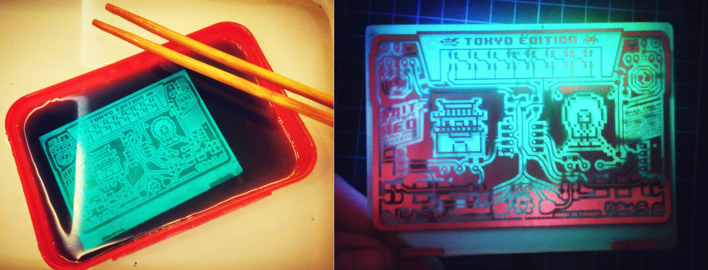
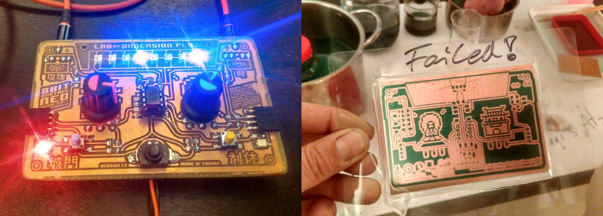
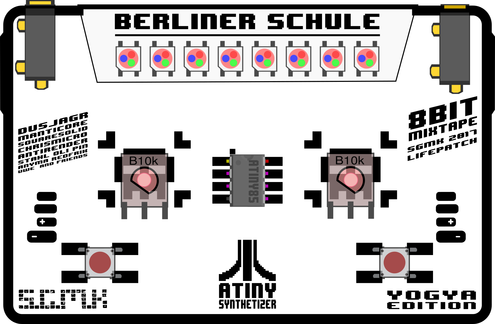

## 8Bit Mixtape NEO V2.xx (Manufactured PCBs)

These boards are based on Schematics 0.96:

See more notes on getting different designs for manufacturing on the [Shenzhen Ready Page](https://github.com/8BitMixtape/8Bit-Mixtape-NEO/wiki/2_4-Shenzhen-Ready)

## 8Bit Mixtape NEO V1.xx (Hand-Made Boards)

### Version 1.6 Tokyo Edition

### Version 1.5 Dimension Plus Edition

### First self-etched board is working

**_ES IST VOLLBRACHT!_**

### Design

Download the [design and MASK .pdf](https://github.com/8BitMixtape/8Bit-Mixtape-NEO/raw/master/boards/8Bit-Mixtape-NEO_v1/8BitMixtapeNEO_v11.pdf)

### V1.xx are all based on this Schematics

## Old development notes 

### Desiged a new Board, hand-etching and beyond for production

still fixing the last details of an optimized pin-use and schematics before designing this... this is just an empty canvas sofar.

design ideas, labels and logos are welcome to be posted here.

I started from scratch again. making sure everything fits and is centered.

* plugs on top or below?
* buttons fit both 6mm and 12mm packages
* ISP possible connectivity on backside. needed at all?
* put a switch on top
* where to put the Sound-prog LED?
* Tape2Tape connector on top or below board?

Made this really nice new tool in Inkscape to be able to change the pads all at once using the "Clone" function

### 1206 or 0805?

Hmmmm in the stores in taipei, the almost don't sell any 1206 anymore...

Hand-soldeirng of 1206 was great so far in our experience. 0805 is also still possible. but kinda small.... which leads us to the next topic:

### Shenzhen ready

think about extending the design for shenzhen style manufacturing.  
See examples from 2016: [http://wiki.sgmk-ssam.ch/wiki/Shenzhen\_Ready](http://wiki.sgmk-ssam.ch/wiki/Shenzhen_Ready)

* extra features on the backside...
* ISP smd plug?
* Extra pads on the back for adding volume poti, flat wheel.
* other gadgets and design elements?
* ### Tapes talking to each other using mini-jack cables?

The output of PB1 \(SOUND-PORT\) can also be used as CV, for Sequencer application.

The input... before we always had them as little pin-headers on the side.

* can we use stereo jack for connecting via normal cable?
* input side, left channel for CV-in, right channel for sound-prog \(or Gate-in if used\)
* remove the cap for decoupling!
  \*

### Power-management

#### main switch for off and reset

hmmm... we need that push-switch.

#### Chargeable?

maybe... but the coins are too small.

#### 3V and on 16MHz -&gt; Overclocking

does that really matter? Rumours go the attiny works only on 5V when set to 16MHZ, but it seems to run fine on the 3.7V LiPo. Here some notes about this.

[https://learn.adafruit.com/introducing-trinket/16mhz-vs-8mhz-clock](https://learn.adafruit.com/introducing-trinket/16mhz-vs-8mhz-clock)

I got the feeling that the speed changes, when tweaking the brightness of the NEO-pixels.

**ToDo:**

* Should we add a voltage regulator 3.3V?
* Why?

**Pro/Con Power Regulated:**

* aref normal Vcc: voltage dividers will lead to same ratio
* Internal ARef 2.56V: leads to different readings on pot, if battery level changes.
* Brightness of LED is not at maximum \(although they are far too bright anyway.
* can we communicate with 5V devices?
* how to run it on LiPo if we want it to be on 5V?
* CV standards?

## First board design, based on Schematics 0.2

this is outdated but kept here for historic reasons and cos it looks nice!

