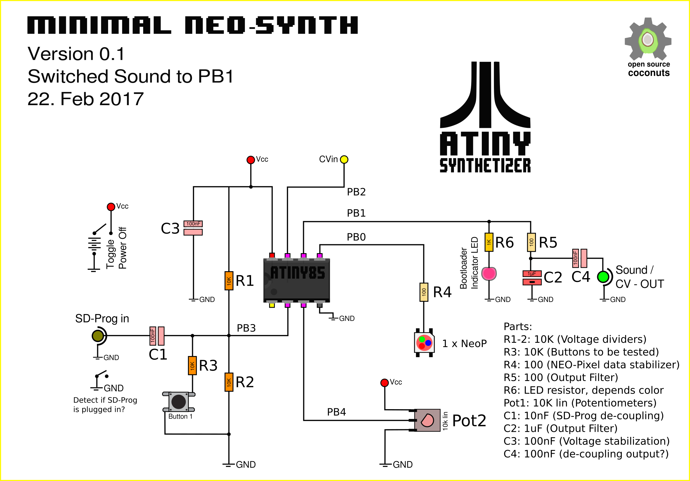

# Discussing the schematics

how to free even more pins on that little attiny85...

## updated the most recent contributions into this Schematics

## Version 0.95 kinda(Final) - Updates from Uwe

More minor improvements, suggested by Uwe:
* Add CV In 2 (cos we can)
* No decoupling cap, or CV out is wrong
* That thing with the switch on the Sound-prog jack.... ?
* What kinda swtiched jack-socket is that?
* 

## Version 0.9 Towards a Final Version - small corrections...

Parts:

* R1-4: 10K \(Voltage dividers\)
* R5: 10K \(Buttons to be tested\)
* R6: 4K7 \(Buttons to be tested\)
* R7: 100 \(NEO-Pixel data stabilizer\)
* R8: 100 \(Output Filter\)
* R9-10: LED resistor \(depends on color\)
* Pot1-2: 10K lin \(Potentiometers\)
* C1: 100nF \(SD-Prog de-coupling\)
* C2: 1uF \(Output Filter\)
* C3: 100nF \(Voltage stabilization\)
* C4: 100nF \(de-coupling output?\)

Pin Use:

* PB0\(pin5\): NEO-pixels
* PB1\(pin6\): Sound output \(parallel LED\)
* PB2\(pin7\): \(A1\) Potentiometer \(right\), CV input
* PB3\(pin2\): \(A3\) Buttons/Switch via Voltage-Dividers
* PB4\(pin3\): \(A2\) Potentiometer \(left\), SD-Prog Jack-3.5mm Input
* PB5\(pin1\): \(A0 \)kinda free pin, can be used for sync / gate signal and communication from the bootloader
* GND\(pin4\):
* Vcc\(pin8\): Power LED, stabilizing cap Vcc-GND. 

## Minimal version for other sound toys

## Version 0.X by chris test

## Version 0.6 & 07 updates from Chris and dusjagr

Still confused about the possibility to detect if the mini-jack is plugged using the "normally connected" part of the jack-socket?

Parts:

* R1-4: 10K \(Voltage dividers\)
* R5: 22K \(Buttons to be tested\)
* R6: 47K \(Buttons to be tested\)
* R7: 100 \(NEO-Pixel data stabilizer\)
* R8: 100 \(Output Filter\)
* Pot1-2: 10K lin \(Potentiometers\)
* C1: 100nF \(SD-Prog de-coupling\)
* C2: 1uF \(Output Filter\)
* C3: 100nF \(Voltage stabilization\)
* C4: 100nF \(de-coupling output?\)

Pin Use:

* PB0\(pin5\): Sound output \(parallel LED\)
* PB1\(pin6\): NEO-pixels
* PB2\(pin7\): \(A1\) Potentiometer \(right\), CV input
* PB3\(pin2\): \(A3\) Buttons/Switch via Voltage-Dividers
* PB4\(pin3\): \(A2\) Potentiometer \(left\), SD-Prog Jack-3.5mm Input
* PB5\(pin1\): \(A0 \)kinda free pin, can be used for sync / gate signal and communication from the bootloader
* GND\(pin4\):
* Vcc\(pin8\): Power LED, stabilizing cap Vcc-GND. 

## Version 0.5 updates from Uwe

Parts:

* R1-5: 10K \(Voltage dividers\)
* R6: 4K7 \(Voltage dividers\)
* R7: 100 \(NEO-Pixel data stabilizer\)
* R8: 100 \(Output Filter\)
* Pot1-2: 10K lin \(Potentiometers\)
* C1: 100nF \(SD-Prog de-coupling\)
* C2: 1uF \(Output Filter\)
* C3: 100nF \(Voltage stabilization\)

## Version 0.2 first prototype with etched board

Others: Do we need extra caps for the NEO-pixels?

# Basic stuff we need

Interface:

* 2 potentiometers
* 2 push-buttons
* 1 Sound output PWM \(PB0 is preferred\) is also CV output in case of Sequencer code
* Sound-progger input
* CV input
* Master-clock or gate output
* Sync-clock input
* 1 pin to communicate wiht the 8 NEO-pixels \(is that cheating?\)
* what else?

