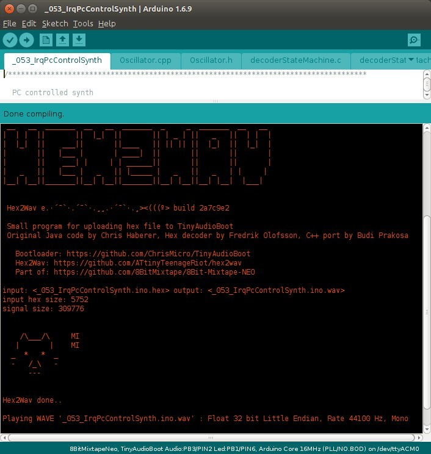
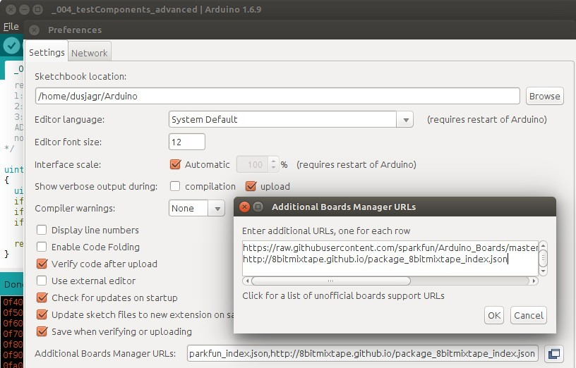
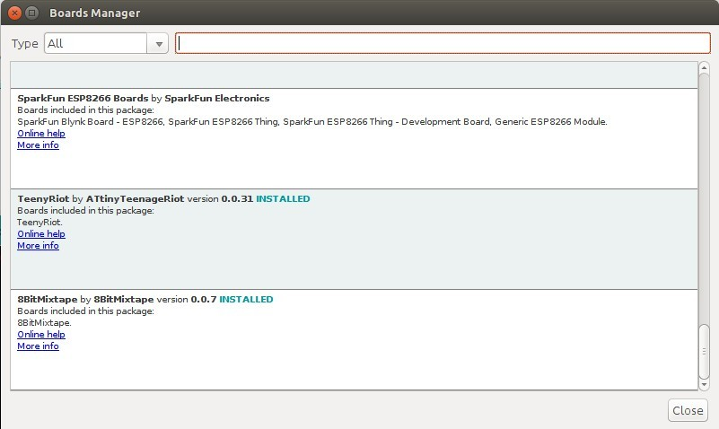

# New update 0.0.8

This is based on the new port of [hex2wav to c++](https://github.com/8BitMixtape/8Bit-Mixtape-NEO/wiki/3_4-Hex2Wav)

You can click on Sketch -> Export compiled Library

This will save the .wav file in your sketch-folder.

# Got it working !!! Thx Iyok!

## Adding the Board to the Arduino IDE

Add this line to your "**Additional Board Manager URLs**" in the Preferences \(click on the little square on the right to open an editable list\):

[http://8bitmixtape.github.io/package_8bitmixtape_index.json](http://8bitmixtape.github.io/package_8bitmixtape_index.json)

Now you can choose in the Board Manager the new package for **8Bit Mixtape**. You will get noticed if new updates are available.

### Choose Board

Now a new package is available in your menu to choose board **"8BitMixtapeNEO"**

At the moment there are various Core and Bootloader to choose from, just use the standard ones on the top of the list. The others are currently there for testing and developing.

Bootloader: **TinyAudioBoot Audio:PB3/PIN2 Led:PB1/PIN6**

Core: **Arduino Core 16MHz \(PLL/NO.BOD\)**

**TODO:**

* rename the stuff to make it more easy to understand
* remove unused stuff, when development is done
* fix the correct memory size, so bootloader is not overwritten
* add other Mixtapes: Berliner Schule \(Attiny84\), 8Bit Mixtape Classic \(Attiny85\)
* ...

## Compile -&gt; Convert -&gt; Upload

It's working...! Just press the upload arrow. It will automatically compile and convert to .wav and play the file on your sound card.

## Save the .wav in sketch folder

In the menu "Sketch" choose -&gt; "Export compiled Binary.

The .wav file will be saved in the same folder where your sketch .ino file is stored, which is usually in your Sketchbook. This is mostly useful if you wanna share the .wav file to friends, put it on your website \(or on a cassette tape\) for others to upload directly to their tapes without re-compiling using this IDE or something. Anyway the .wav file is always saved in the /tmp/.. folder.

* this maybe \(hopefully\) won't work on windows. But you also find the file in the /tmp/... folder somewhere. check the verbose output of your Arduino IDE.

# Open Issues

still some confusion about the timers, pre-scalers and the speeds...

[http://www.re-innovation.co.uk/web12/index.php/en/blog-75/305-fast-pwm-on-attiny85](http://www.re-innovation.co.uk/web12/index.php/en/blog-75/305-fast-pwm-on-attiny85)

