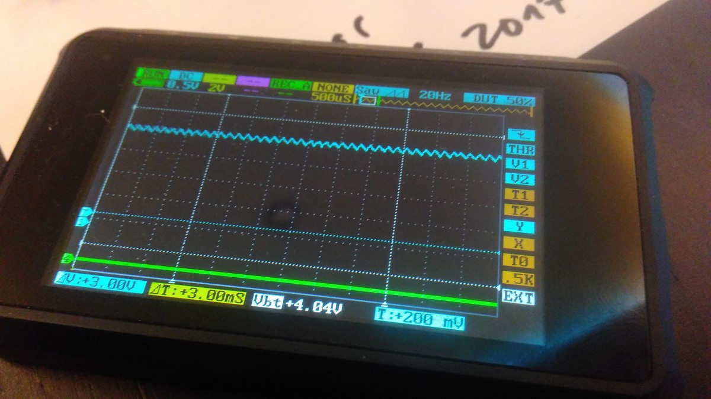
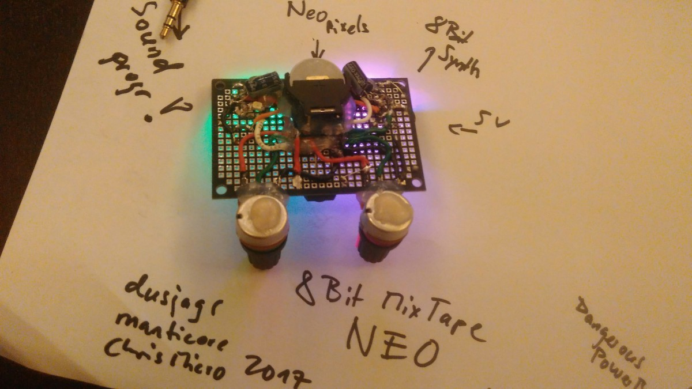

# Dusjagr's prototype Made in Taiwan

Finally i could finish my prototype! And it seems to work...

only had 12k resistors, but doesnt matter

# Uploading the first codes

First upload the bootloader. i tried to do it from the arduino... but not sure if it works. best to use the pre-combiled hex from chris. so we all have the same stuff on the board.

[https://github.com/ChrisMicro/AttinySound/tree/master/AudioBoot](https://github.com/ChrisMicro/AttinySound/tree/master/AudioBoot)

### set the fuses

`avrdude -P /dev/ttyACM0 -b 19200 -c avrisp -p t85 -U efuse:w:0xfe:m -U hfuse:w:0xdd:m -U lfuse:w:0xe1:m`

### upload the bootloader

`avrdude -v -pattiny85 -c avrisp -P/dev/ttyACM0 -b19200 -Uflash:w:/.../AttinySound-master/AudioBoot/AudioBootAttiny85_InputPB3_LEDPB1.hex:i`

`avrdude -v -pattiny85 -c avrisp -P/dev/ttyACM0 -b19200 -Uflash:w:/home/dusjagr/Arduino/AttinySound-master/AudioBoot/AudioBootAttiny85_InputPB3_LEDPB1.hex:i`

### Testing

what you should see now is a slow blink on PB1, hopefully you have an LED there. The first time the bootloader waits forever to be programmed. Later when something is on, it will switch to running the code after approx 5 seconds. \(maybe we can decrease this\).

You can already test with the premade .wav files. maybe even directly from your browser:

[https://raw.githubusercontent.com/ChrisMicro/AttinySound/master/wavForAudioBoot/\\_000\\_testComponents.ino.wav](https://raw.githubusercontent.com/ChrisMicro/AttinySound/master/wavForAudioBoot/\_000\_testComponents.ino.wav)

When uploading \(playing the song\) the LED starts blinink faster, and the code starts to run, when upload finished

### Sound-card settings

I had to reduce the volume slightly from max... between 50-90% of my laptop volume works fine.

## Installing the hex2wav java thingy

had to install default-jar... then open like this:

`~/Arduino/AttinySound-master/AudioBoot$ java -jar AudioBootAttiny85.jar`

## The Capacitor stories

on the sound prog, should we use 100nF or 10nF. both worked fine for me... \(i think\).

## Reducing the noise on the Analog pins

seems too noisy!

Lets' look closer. hmmm some oscillation...

let's add another Angst-Kondenserli.

**Results:**

100nF on the chip... hmmmm, didnt help

Changing the power supply from the DIY powerbank to arduino, powered via USB from laptop -&gt; kinda better!

added another big cap on the neo-pixel power, 220uF on the other side. 100nF was already there.

## Power Management

How should we power the board? Turns out if we don't use brown-out detection we can still run it on lipo's!!

Now powering it from a lipo-charger unit, with battery protection. testing how long it lasts... but i guess with these small coin-lipos not too long.

## Why??

