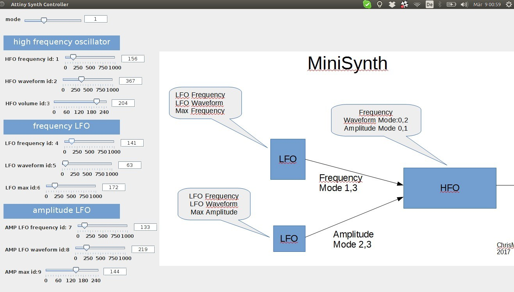

# PC communication to Attiny

## Talk to NEO-Coconut in RT from laptop

[https://github.com/ChrisMicro/AttinySound/tree/master/\\_052\\_PC\\_controlSynth](https://github.com/ChrisMicro/AttinySound/tree/master/\_052\_PC\_controlSynth)

## New Version to control all aspects of the synth



Find example here:

https://github.com/ChrisMicro/AttinySound/tree/master/_053_IrqPcControlSynth

or upload it directly by playing this [.wav](https://github.com/8BitMixtape/8Bit-Mixtape-NEO/raw/master/Code/_053_IrqPcControlSynth/_053_IrqPcControlSynth.ino.wav)


```
java -jar ./Main_IrqPcControllerForSynth.jar
```

# How about "Talking back"?

coming soon!

would be great to "listen" to the attiny from a browser. so i can look at values from sensor from my (notvery) smart-phone.

https://publiclab.org/wiki/webjack

# How can one MixTape talk to the other one?

CV... yes. but using this communication?


