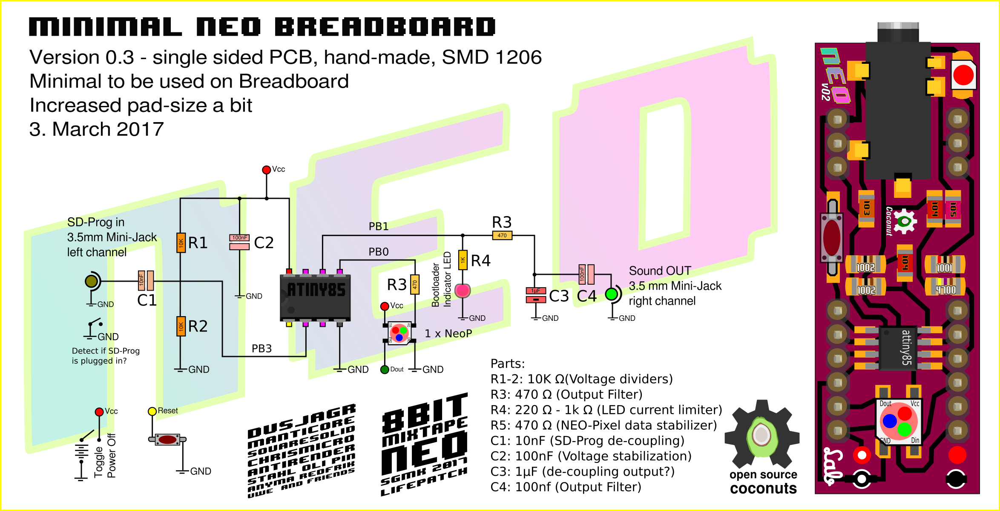
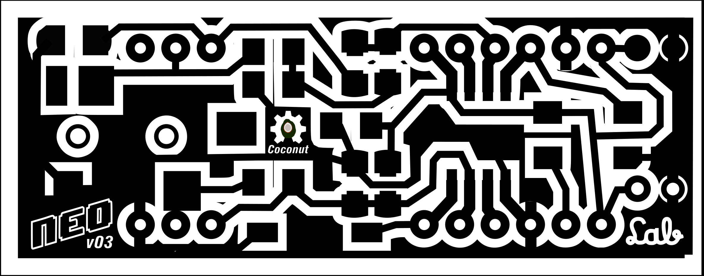

# Minimal Audio-Prog Boards

## SMD 1-sided version, with 1-Pixel

### Schematics

Simplified schematics for prototyping projects on a breadboard. Includes 1 Neo-pixel. Output of PB1 is filtered and put on the right channel of the mini-jack.

**Correction:** R3 is after the R4/LED.

### Pin Layout

Small footprint, fits on breadboard.

### Mask and Making instruction

**NEO-Coconut v0.3**

_Don't forget to mirror it on case you use photo-etching._

See the masks being updated in the repo:

[https://github.com/8BitMixtape/8Bit-Mixtape-NEO/blob/master/boards/MakeYourOwn\\_MASK\\_v03.pdf](https://github.com/8BitMixtape/8Bit-Mixtape-NEO/blob/master/boards/MakeYourOwn\_MASK\_v03.pdf)

### **It works!**

## Make your own prototype

# Other stuff

